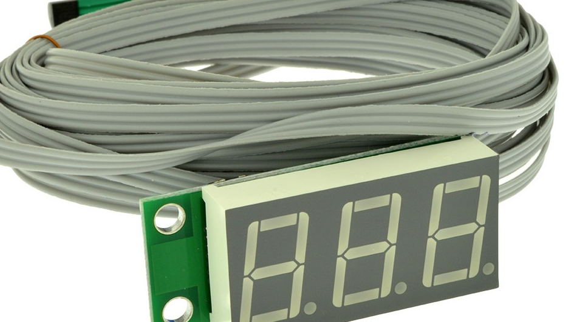

# Tiny-therm project
### It's an alternative firmware version for a similar circuit board

#### - Why does it need? 
#### - Because default firmware does not work with a 2-wire scheme (without power).

#### The firmware reads the temperature from the sensor and shows it on the display.
#### MCU type - ATtiny261A
### Sensor type - DS18B20

#### Pinouts:
 | PORT | description |
 |------|-------------|
 |PORTB0| 7 segment B |
 |PORTB1| 7 segment F |
 |PORTB2| 7 segment A |
 |PORTB3| 7 segment G |
 |PORTB4| 7 segment C |
 |PORTB5| 7 segment E |
 |PORTB6| 7 segment D |
 |PORTA0| 7 segment DIGIT 3 |
 |PORTA1| 7 segment DIGIT 2 |
 |PORTA2| 7 segment DIGIT 1 |
 |PORTA6| 7 segment DP |
 |PORTA7| 1-WIRE line |